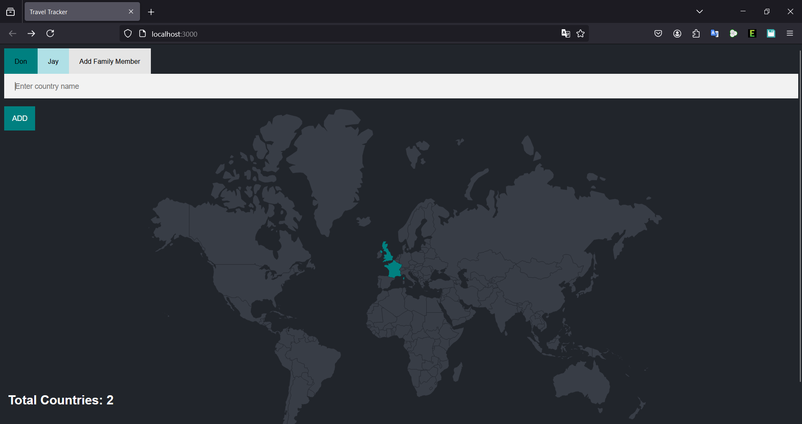

# Family Travel Tracker



## Overview
The Family Travel Tracker is a Node.js application designed to help families see countries they have visited on the map.

---

## Features
- Add and view countries visited by family members
- Simple and intuitive user interface
- Local hosting on port `3000`

---

## Prerequisites
Make sure you have the following installed:

- **Node.js** (v14 or later)
- **npm** (Node Package Manager)

---

## Installation and Setup
1. Clone the repository:
   ```bash
   git clone https://github.com/Jayminai/family-travel-tracker.git
   ```

2. Navigate into the project directory:
   ```bash
   cd family-travel-tracker
   ```

3. Install the dependencies:
   ```bash
   npm install
   ```

4. Start the application:
   ```bash
   node index.js
   ```

5. Open your browser and go to:
   ```
   http://localhost:3000
   ```

---

## Usage
1. Open the application in your browser.
2. Add countries your family's visited.
3. Add each memeber of your family as needed.

---